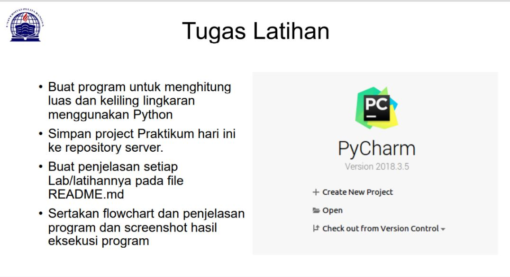
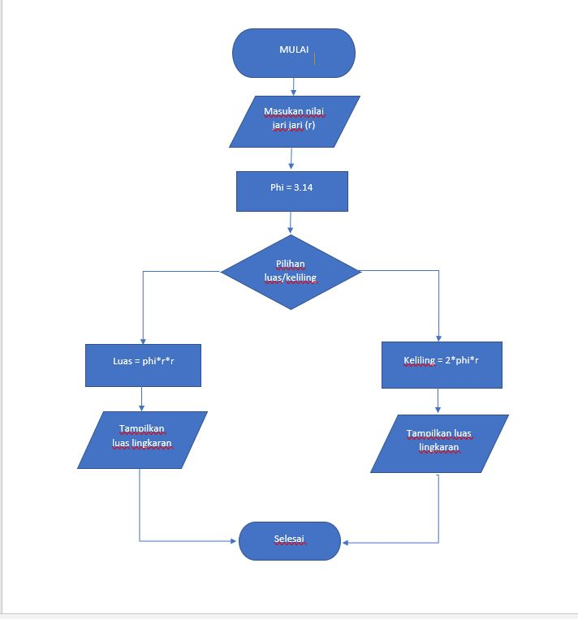
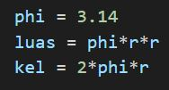

# project-python

## flowchart

untuk menentukan langkah langkah menghitung luas dan keliling lingkaran 

# Menghiung Luas dan Keliling Lingkaran

## Code untuk menghitung  

    print("program menghitung luas dan keliling lingkaran")
    r = int(input("masukan jari jari = "))

    phi = 3.14
    luas = phi*r*r
    kel = 2*phi*r

    print ("Luas Lingkaran \t= ",format(luas,'.2f'))
    print ("Keliling Lingkaran \t= ",format(kel,'.2f'))

## Rumus Menghitung

rumus untuk menghitung luas dan keliling linngkaran

    nilai phi yang digunakan adalah 14 
    dan r adalah jari jari lingkaran

## Output

ini adalah hasil output jika dimasukan jari jari dengan nilai 30

## Penjelasan

untuk mengambil 2 angka pecahan saja kita pakai fungsi format '.2f' seperti berikut:

dengan rumus seperti diatas dapat mengambil kesimpulan 2 angka dibelakang titik
